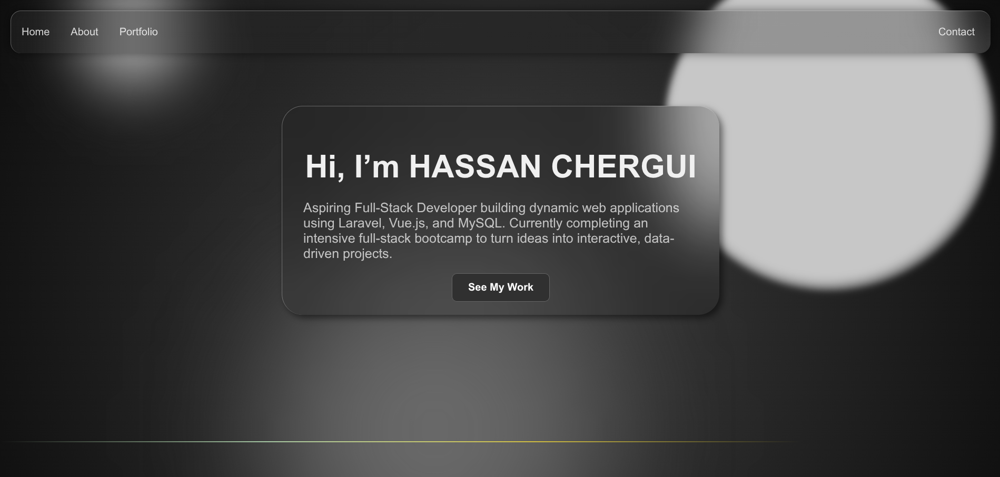

# Simple HTML Portfolio Page

A single-page portfolio built with HTML and CSS, featuring smooth background animations, blur effects, and glassmorphism UI elements for a clean, modern look.
---

## Features

- Fully responsive single-page layout  
- Smooth **background animations**  
- **Opacity and blur effects** for visual depth  
- Sections: Home, About, Portfolio, Contact  
- Clean and minimal design using CSS  

---

## Technologies Used

- **HTML5**  
- **CSS** (Animations, transitions, opacity, blur)  

---

## Screenshot

  

---

## How to Run

1. Clone or download the repository:  
```bash
git clone https://github.com/hassan-chergui/portfolio_v0.4.17.3
```
2. Navigate into the project directory:
```bash
cd portfolio_v0.4.17.3
```
3. Open the main .html file in any modern web browser to view the portfolio.
